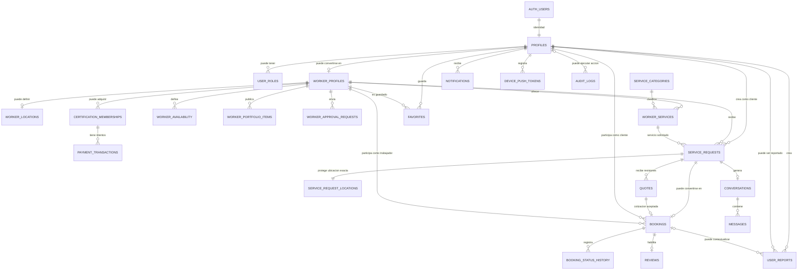

# Contrátame! — ERD Conceptual v1

## Estado del documento

**Versión:** 1.0  
**Estado:** APPROVED / FROZEN  
**Fecha de congelamiento:** 2026-09-09  
**Nivel:** Modelo conceptual  
**SQL implementado:** No  
**Migraciones creadas:** No  

Este documento constituye la fuente conceptual aprobada del modelo de datos de Contrátame! para el inicio del desarrollo.

Cualquier cambio estructural posterior deberá documentarse explícitamente y, cuando corresponda, mediante un Architecture Decision Record (ADR) y una nueva versión del modelo.

---

# 1. Objetivo

Este documento consolida las decisiones conceptuales aprobadas para el modelo de datos de Contrátame! y presenta el modelo entidad-relación inicial del sistema.

En esta etapa se definen:

- Entidades.
- Responsabilidades.
- Relaciones.
- Cardinalidades.
- Reglas de negocio estructurales.
- Límites de privacidad.
- Dependencias principales.

Los tipos físicos definitivos, constraints, índices, funciones SQL, políticas RLS y migraciones se definen en el esquema lógico y posteriormente en las migraciones.

---

# 2. Principios generales

## 2.1 Identidad y autenticación

Supabase Auth administrará la identidad mediante:

`auth.users`

Cada identidad autenticada tendrá exactamente un perfil general:

`profiles`

Relación:

```text
auth.users
    │
    │ 1:1
    ▼
profiles
```

Contrátame! no almacenará contraseñas ni duplicará credenciales.

---

## 2.2 Cliente como capacidad por defecto

Todo usuario registrado puede utilizar la plataforma como cliente.

No se creará inicialmente:

`customer_profiles`

Un usuario se convierte adicionalmente en trabajador al crear:

`worker_profiles`

Relación:

```text
profiles
   │
   │ 1 : 0..1
   ▼
worker_profiles
```

---

## 2.3 Roles privilegiados

Los permisos administrativos se almacenarán separadamente en:

`user_roles`

Esto evita modelar `customer` y `worker` como roles mutuamente excluyentes.

Relación:

```text
profiles
   │
   │ 1 : 0..N
   ▼
user_roles
```

---

# 3. Aprobación de trabajadores

El estado actual de publicación profesional vive en:

`worker_profiles.approval_status`

Estados conceptuales:

```text
draft
pending_approval
approved
rejected
suspended
```

El historial de revisiones se mantiene en:

`worker_approval_requests`

Relación:

```text
worker_profiles
      │
      │ 1 : N
      ▼
worker_approval_requests
```

Reglas:

- Crear perfil profesional es gratuito.
- Un trabajador puede editar su perfil mientras está en borrador.
- El trabajador puede enviarlo a revisión.
- Solo administradores pueden aprobar, rechazar o suspender.
- Un trabajador no aprobado no aparece públicamente.
- Las revisiones anteriores no se sobrescriben.

---

# 4. Certificación

La aprobación administrativa y la certificación son procesos diferentes.

La certificación:

- Es opcional.
- Tiene un precio inicial planteado de Bs 50.
- Solo puede activarse para un trabajador administrativamente aprobado.
- No sustituye la aprobación.
- Su duración y renovación todavía no están definidas.

La entidad principal es:

`certification_memberships`

Relación:

```text
worker_profiles
      │
      │ 1 : N
      ▼
certification_memberships
```

Los pagos se almacenan en:

`payment_transactions`

Una membresía puede tener múltiples intentos de pago:

```text
certification_memberships
      │
      │ 1 : N
      ▼
payment_transactions
```

Ejemplo:

```text
Membership #1
├── Payment attempt #1 → failed
├── Payment attempt #2 → failed
└── Payment attempt #3 → paid
```

El badge certificado se deriva de:

```text
worker_profiles.approval_status = approved
AND
certification_membership.status = active
```

No se utilizará un booleano independiente `is_certified` como fuente canónica.

---

# 5. Ubicación del trabajador

La geolocalización profesional se almacena separadamente en:

`worker_locations`

Relación:

```text
worker_profiles
      │
      │ 1 : 0..1
      ▼
worker_locations
```

La ubicación es opcional mientras el perfil está en estado `draft`.

Sin embargo, será obligatoria antes de permitir el envío del perfil a aprobación.

La entidad contendrá conceptualmente:

- Ubicación privada exacta.
- Ubicación pública aproximada.
- Etiqueta de zona.
- Ciudad.
- Departamento.
- Radio de servicio.

El MVP no utilizará seguimiento GPS continuo del trabajador.

---

# 6. Privacidad de ubicación del trabajador

La ubicación exacta del trabajador es información privada.

La aplicación pública no deberá consultar directamente:

`worker_locations.private_location`

Las búsquedas de proximidad se realizarán mediante una operación controlada de PostgreSQL/PostGIS.

Ejemplo conceptual:

```text
search_nearby_workers(
  customer_location,
  category,
  radius
)
```

La función podrá utilizar internamente la ubicación exacta, pero devolverá únicamente información segura como:

```text
worker_id
display_name
public_area_label
public_location
distance_m
rating
certified
```

Nunca:

```text
private_location
```

---

# 7. Catálogo de servicios

Las categorías generales viven en:

`service_categories`

Ejemplos:

- Electricidad.
- Plomería.
- Carpintería.
- Construcción.
- Limpieza.
- Jardinería.
- Pintura.
- Mecánica.

Los servicios concretos ofrecidos por cada trabajador viven en:

`worker_services`

Relación:

```text
worker_profiles
      │
      │ 1 : N
      ▼
worker_services
      │
      │ N : 1
      ▼
service_categories
```

---

# 8. Disponibilidad

La disponibilidad regular vive en:

`worker_availability`

Relación:

```text
worker_profiles
      │
      │ 1 : N
      ▼
worker_availability
```

Cada registro representa un bloque horario recurrente.

---

# 9. Portafolio

Los trabajos anteriores se modelan mediante:

`worker_portfolio_items`

Relación:

```text
worker_profiles
      │
      │ 1 : N
      ▼
worker_portfolio_items
```

Las imágenes se almacenarán en Supabase Storage.

La base de datos almacenará rutas o referencias.

---

# 10. Solicitudes directas de servicio

El MVP utilizará un modelo de solicitud directa.

Flujo:

```text
Cliente
  ↓
Busca profesional
  ↓
Abre perfil
  ↓
Selecciona servicio
  ↓
Envía solicitud a ese trabajador
```

La entidad es:

`service_requests`

Cada solicitud pertenece conceptualmente a:

- Un cliente.
- Un trabajador.
- Un servicio ofrecido por ese trabajador.

No se implementará inicialmente un mercado abierto donde múltiples trabajadores compitan por la misma solicitud.

---

# 11. Ubicación exacta del trabajo del cliente

Por seguridad, la ubicación exacta del trabajo se separa de `service_requests`.

La información general de la solicitud se almacena en:

`service_requests`

La ubicación sensible se almacena en:

`service_request_locations`

Relación:

```text
service_requests
      │
      │ 1 : 1
      ▼
service_request_locations
```

Antes de una contratación, el trabajador puede ver información aproximada como:

```text
Equipetrol, Santa Cruz
```

pero no necesariamente:

```text
coordenadas exactas
dirección exacta
número de vivienda
```

El cliente propietario y el trabajador autorizado después de la contratación podrán acceder a los datos exactos según las políticas de seguridad.

Otros usuarios no tendrán acceso.

---

# 12. Cotizaciones

Las cotizaciones viven en:

`quotes`

Relación:

```text
service_requests
      │
      │ 1 : N
      ▼
quotes
```

Una solicitud puede tener varias revisiones históricas.

Ejemplo:

```text
Quote #1 → superseded
Quote #2 → rejected
Quote #3 → accepted
```

Solo una cotización puede ser aceptada para una solicitud.

---

# 13. Booking / contratación

Cuando una cotización es aceptada, se crea:

`bookings`

Relaciones:

```text
service_requests
      │
      │ 1 : 0..1
      ▼
bookings
```

y:

```text
quotes
   │
   │ 1 : 0..1
   ▼
bookings
```

El booking conserva datos históricos importantes:

- Cliente.
- Trabajador.
- Servicio acordado.
- Precio acordado.
- Fecha programada.
- Estado.

Los cambios posteriores al perfil o al precio actual del trabajador no alterarán el acuerdo histórico.

---

# 14. Ciclo de vida del booking

Estados aprobados para el MVP:

```text
scheduled
    ↓
in_progress
    ↓
completion_pending
    ↓
completed
```

También:

```text
cancelled
```

Reglas:

- El trabajador inicia el trabajo.
- El trabajador solicita la finalización.
- El cliente confirma la finalización.
- No existe finalización automática en el MVP.
- Cancelar no elimina el booking.

---

# 15. Historial del booking

Los cambios de estado se registran en:

`booking_status_history`

Relación:

```text
bookings
   │
   │ 1 : N
   ▼
booking_status_history
```

Se mantiene el patrón:

```text
estado actual
+
historial
```

---

# 16. Reviews

Las reseñas viven en:

`reviews`

Relación:

```text
bookings
   │
   │ 1 : 0..1
   ▼
reviews
```

Reglas MVP:

- Solo el cliente califica al trabajador.
- El booking debe estar `completed`.
- Solo una reseña por booking.
- La calificación promedio se deriva de los registros de `reviews`.

---

# 17. Favoritos

Los favoritos viven en:

`favorites`

Representan un marcador privado.

Relaciones:

```text
profiles
   │
   │ 1 : N
   ▼
favorites
   │
   │ N : 1
   ▼
worker_profiles
```

Reglas:

- No crean conversación.
- No crean solicitud.
- No crean booking.
- No notifican al trabajador.
- No se permiten duplicados.

---

# 18. Conversaciones

Una conversación se crea como consecuencia de una solicitud real de servicio.

Entidad:

`conversations`

Relación:

```text
service_requests
      │
      │ 1 : 0..1
      ▼
conversations
```

El chat no será una red social abierta.

---

# 19. Mensajes

Los mensajes viven en:

`messages`

Relación:

```text
conversations
      │
      │ 1 : N
      ▼
messages
```

Tipos iniciales:

```text
text
system
```

Una conversación cerrada permanece legible, pero no permite nuevos mensajes.

---

# 20. Notificaciones

Las notificaciones internas viven en:

`notifications`

Relación:

```text
profiles
   │
   │ 1 : N
   ▼
notifications
```

Las notificaciones push son solamente un mecanismo de entrega externo.

Los dispositivos se almacenan en:

`device_push_tokens`

Relación:

```text
profiles
   │
   │ 1 : N
   ▼
device_push_tokens
```

---

# 21. Reportes

Los reportes viven en:

`user_reports`

Cada reporte relaciona:

- Usuario que reporta.
- Usuario reportado.
- Booking opcional.
- Motivo.
- Estado.
- Revisión administrativa.

Estados conceptuales:

```text
open
under_review
resolved
dismissed
```

Un reporte nunca produce sanción automática.

---

# 22. Auditoría

Las acciones sensibles viven en:

`audit_logs`

Ejemplos:

- Trabajador aprobado.
- Trabajador rechazado.
- Trabajador suspendido.
- Cuenta suspendida.
- Certificación activada.
- Reporte resuelto.

Los logs son conceptualmente append-only.

No se usarán para eventos triviales de interfaz.

---

# 23. ERD conceptual aprobado



---

# 24. Inventario congelado de entidades

## Externa / Supabase

1. `auth.users`

## Usuarios

2. `profiles`
3. `user_roles`

## Trabajadores

4. `worker_profiles`
5. `worker_locations`
6. `worker_services`
7. `worker_availability`
8. `worker_portfolio_items`

## Catálogo

9. `service_categories`

## Aprobación

10. `worker_approval_requests`

## Certificación

11. `certification_memberships`
12. `payment_transactions`

## Marketplace

13. `service_requests`
14. `service_request_locations`
15. `quotes`
16. `bookings`
17. `booking_status_history`

## Reputación

18. `reviews`
19. `favorites`

## Comunicación

20. `conversations`
21. `messages`
22. `notifications`
23. `device_push_tokens`

## Moderación y auditoría

24. `user_reports`
25. `audit_logs`

Total conceptual:

```text
25 entidades propias
+
auth.users administrada por Supabase
```

---

# 25. Dependencias de seguridad aprobadas

## Búsqueda pública de trabajadores

No se permitirá acceso público directo a la ubicación privada.

Las búsquedas utilizarán una operación controlada PostGIS.

---

## Ubicación del cliente

La dirección exacta de un servicio se mantiene separada de la información general de la solicitud.

---

## Approval

La visibilidad pública depende únicamente de:

```text
worker_profiles.approval_status = approved
```

---

## Certificación

La certificación nunca reemplaza aprobación.

---

## Reviews

Una reseña solo puede originarse desde un booking completado.

---

## Chat

Una conversación solo existe dentro de una interacción real de servicio.

---

# 26. Datos derivados

No serán fuentes independientes de verdad:

```text
worker_profiles.is_certified
worker_profiles.average_rating
worker_profiles.review_count
worker_profiles.distance_from_customer
```

Se derivarán de:

- `certification_memberships`
- `reviews`
- PostGIS

---

# 27. Decisiones pendientes que NO modifican este freeze inicial

Continúan pendientes:

1. Duración exacta de la certificación.
2. Renovación.
3. Criterios adicionales del badge.
4. Proveedor de pagos.
5. Estrategia exacta para generar `public_location`.
6. Radio mínimo y máximo permitido.
7. Requisitos completos para enviar perfil a aprobación.
8. Política detallada de cancelaciones.
9. Política de disputas.
10. Política de no-show.
11. Política de eliminación/anominización.
12. Retención de mensajes.
13. Retención de audit logs.
14. Proveedor definitivo de push.
15. Política final de moderación de reviews.

Estas decisiones deberán resolverse antes de implementar los módulos afectados.

---

# 28. Regla de congelamiento

A partir de esta versión:

- Codex deberá tratar este documento como arquitectura conceptual aprobada.
- No deberá agregar entidades o alterar cardinalidades sin una decisión explícita.
- Cambios posteriores deberán registrarse en documentación.
- Cambios arquitectónicos relevantes requerirán ADR.
- El esquema físico deberá respetar este modelo salvo decisión documentada.

---

# 29. Próximo paso

El próximo paso será congelar el esquema lógico correspondiente y realizar el primer commit oficial del repositorio.

Después de ese commit, Contrátame! estará listo para abrirse formalmente en Codex.
